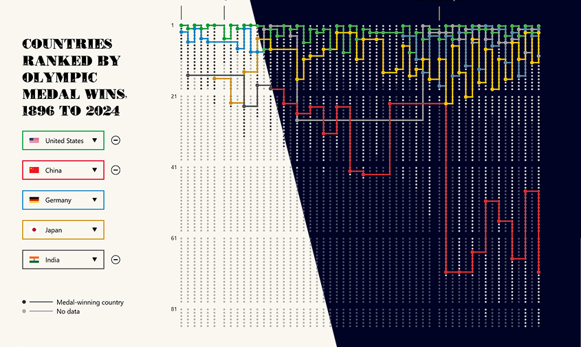

# D3 Dashboard: Top Countries by Olympic Medals (1896-2024)

This project is an interactive D3.js dashboard that visualizes the ranking of top-performing countries by Olympic medal wins from 1896 to 2024. The dashboard provides an engaging way to track how country rankings have changed over time in Olympic history.

## Data Source
The dataset was scraped as part of a separate work, which has been published on GitHub. You can find it <a href="https://github.com/ayoubelbazzazi/olympics_medal_tables">here</a>. 

## Demo
The live dashboard can be accessed here: <a href="https://dash3.ayoubelbazzazi.com">Dashboard link</a>

